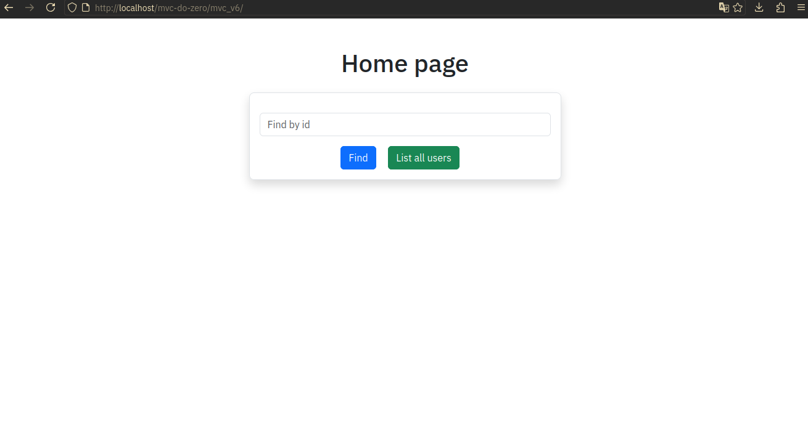
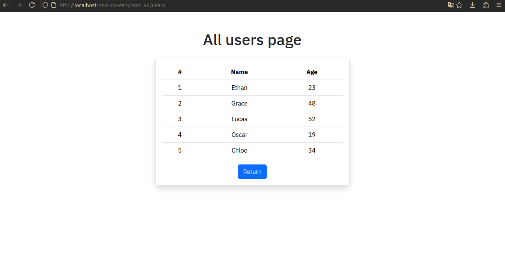

# MVC do zero

**MVC do Zero** é um projeto criado com o objetivo de aplicar meus estudos sobre o padrão **MVC** e sistemas de **Rotas** utilizando PHP puro. Durante o desenvolvimento, enfrentei diversos desafios até alcançar uma compreensão sólida sobre a arquitetura MVC e o uso de rotas, sempre aplicando princípios de **Orientação a Objetos**. O foco do projeto está na simplicidade e clareza, com ênfase nas rotas e na manipulação de usuários armazenados em um banco de dados. Com base na URI fornecida, um controller é instanciado, um método é acionado, e a view correspondente é renderizada.

O projeto tem um caráter didático, sendo idealizado exclusivamente para fins de aprendizado.

# Evolução do Projeto

O projeto foi desenvolvido em várias etapas, com cada versão representando uma evolução da anterior. Abaixo estão as sinopses de cada versão:

## MVC v0 - O Início

Esta versão introduziu o básico do padrão MVC, contendo toda a lógica em um único arquivo (`index.php`). Foi uma implementação simples, mas funcional, permitindo o entendimento inicial de como o MVC opera.

## MVC v1 - Estrutura de Pastas

Nesta versão, as classes foram organizadas em suas respectivas pastas (`Model`, `Controller`, `View`), seguindo uma estrutura mais próxima do padrão MVC. Além disso, foi implementado o autoload das classes usando a função `spl_autoload_register`.

## MVC v2 - Autoload e Banco de Dados

As classes foram renomeadas para refletir melhor o padrão MVC. Além disso, foi adicionado um banco de dados **SQLite** e a conexão passou a ser realizada via **PDO**. O **Composer** foi utilizado para autoload das classes, implementando o padrão **PSR-4**.

## MVC v3 - Sistema de Rotas

Nesta versão, foi introduzido um sistema básico de **jotas**, permitindo capturar a URI da URL e direcionar a requisição para o **controller** e **método** corretos.

## MVC v4 - Parâmetros na URI

A classe **Router** foi aprimorada para lidar com **parâmetros** na URI, possibilitando a listagem de usuários com base em IDs fornecidos na URL.

## MVC v5 - Redirecionamento e Sanitização de Parâmetros

Adicionei arquivos **.htaccess** para redirecionar as requisições para o `index.php`, padronizando o início do projeto. Foi implementado também um método para **sanitização** dos parâmetros da URI, aumentando a segurança da aplicação.

## MVC v6 - Query Strings e Melhorias de Interface

Nesta versão, a classe **Router** foi ajustada para trabalhar com **query strings**. A interface foi aprimorada com o uso do **Bootstrap** para estilização, proporcionando uma melhor experiência visual.

## MVC v6.1 - Renderização com Plates

Essa versão foi um spin-off, onde foi introduzido o **Plates**, um sistema de templates, para renderização das views de forma mais eficiente e estruturada.